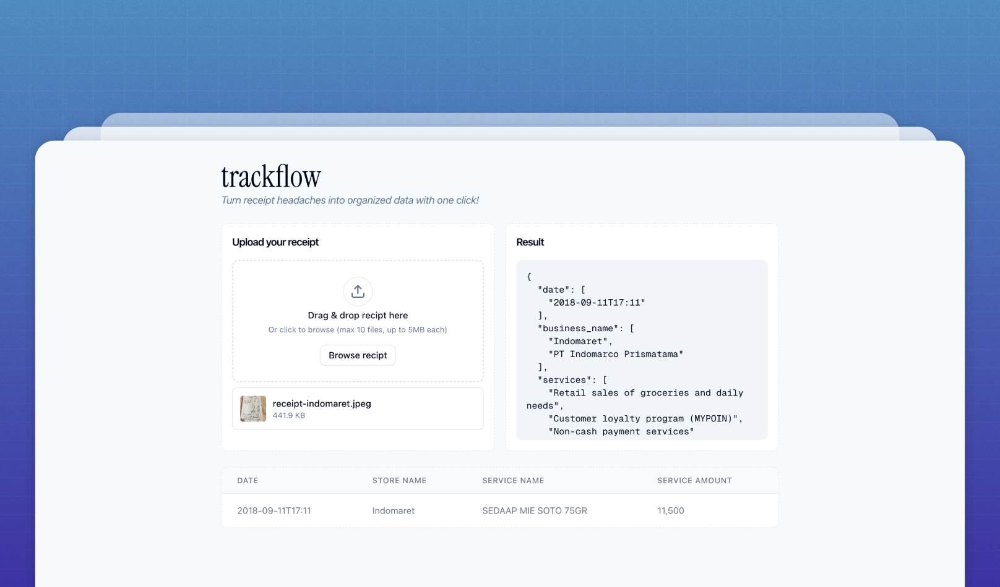

# TrackFlow



TrackFlow is a web application that allows users to upload receipts and extract relevant information from them, such as the date, business name, service name, and service amount. The extracted data is then displayed in a table format for easy viewing and analysis.

## Features

- Upload receipts
- Extract relevant information from receipts
- Display extracted data in a table format

## Tech Stack

- Next.js
- Tailwind CSS
- Shadcn UI
- JigsawStack

## Installation

1. Clone the repository
2. Install dependencies:
```bash
npm install
```
3. Run the development server:
```bash
npm run dev
```

Environment variables:

- `JIGSAWSTACK_API_KEY`
- `NEXT_PUBLIC_JIGSAWSTACK_PUBLIC_KEY`

4. Open [http://localhost:3000](http://localhost:3000) with your browser to see the result.
